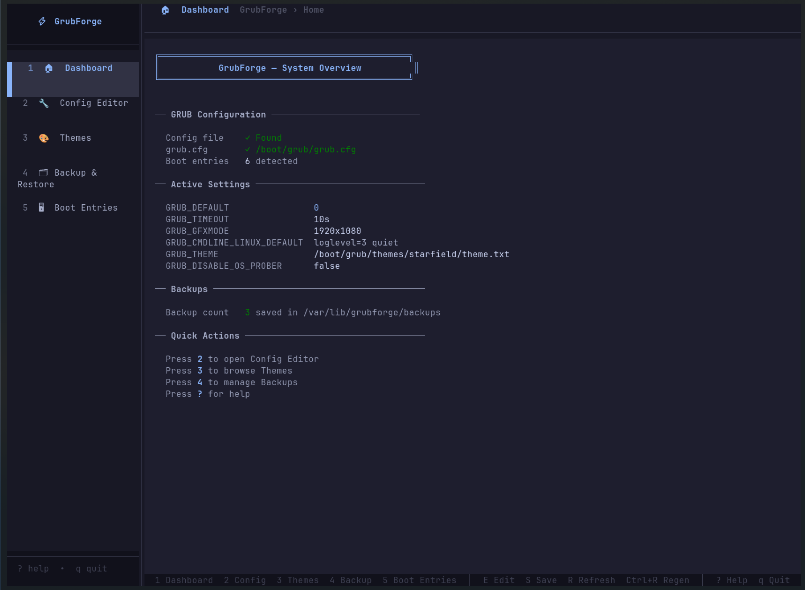
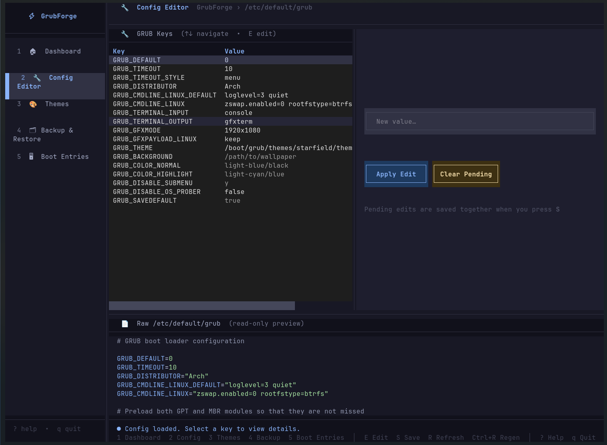
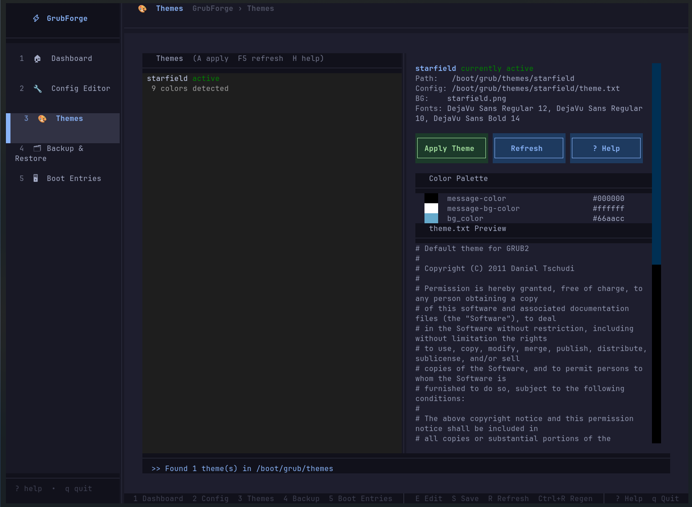
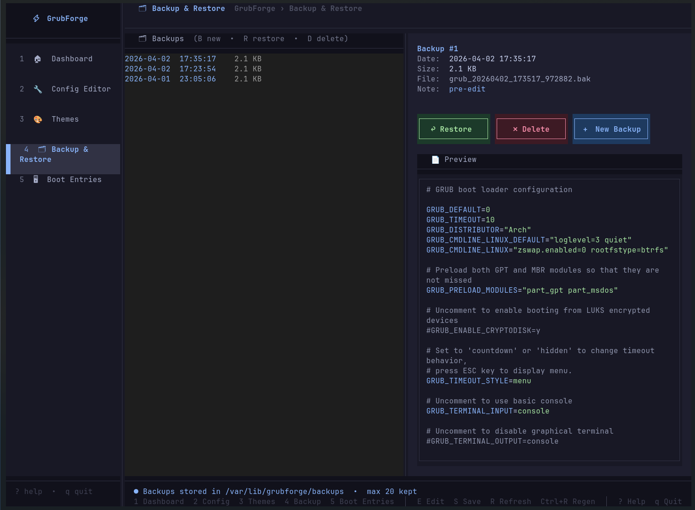
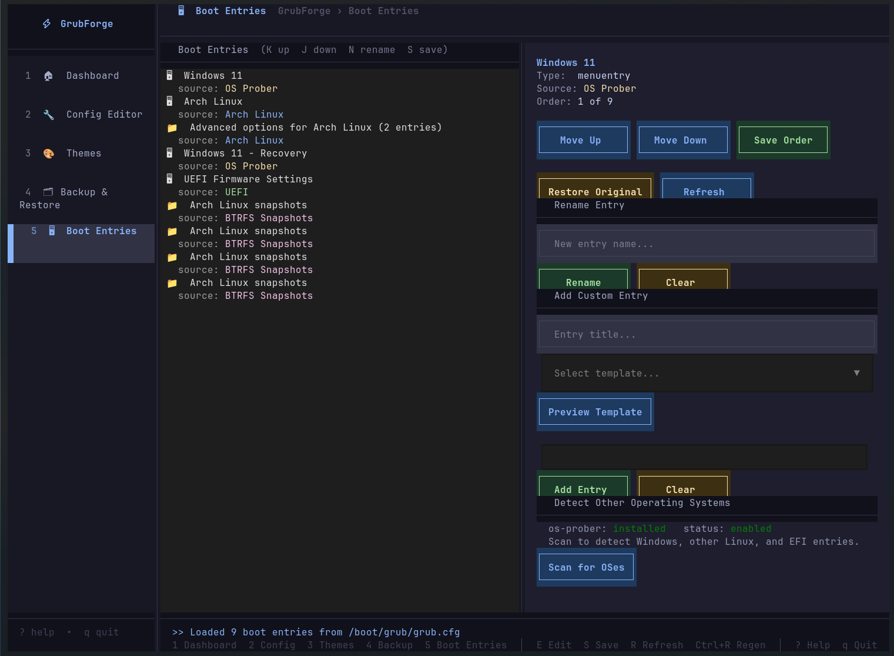

# ⚡ grubForge

> A terminal UI application for managing and customizing the GRUB bootloader on Linux — safely, intuitively, and beautifully.


[](https://aur.archlinux.org/packages/grubforge)

---

## Why grubForge?

GRUB is the first program your computer runs after powering on. It is responsible for loading your operating system — and if it breaks, your machine won't boot. Editing it has traditionally meant opening a terminal, manually editing a configuration file as root, hoping you didn't make a typo, and running a command to compile the changes.

There is no safety net. One wrong character can leave you staring at a black screen.

**grubForge exists to change that.**

We believe managing your bootloader should be:
- **Safe** — automatic backups before every change, confirm dialogs before every action
- **Clear** — every setting explained in plain language, live validation before anything is written
- **Beautiful** — a Catppuccin Mocha themed TUI that feels like a proper application, not a 1980s config screen
- **Accessible** — keyboard-driven, fast, and usable by people who are not bootloader experts

grubForge was born from a simple frustration: why is one of the most critical pieces of your Linux system also one of the most unfriendly to interact with? It doesn't have to be.

---

## Features

- 🏠 **Dashboard** — system overview showing GRUB config status, active settings, backup count, and a live sync indicator that flags when `grub.cfg` is out of date with `/etc/default/grub`
- 🔧 **Config Editor** — view and edit all GRUB settings with descriptions and live validation; required vs optional keys distinguished so optional keys can be cleared
- 🎨 **Theme Browser** — browse locally installed GRUB themes, preview color palettes, apply with one key, and get guided help on installing new themes
- 🖥 **Boot Entries** — reorder, rename, and create custom boot entries, detect other OSes via os-prober, save a custom order, and restore the original at any time
- 🗂 **Backup & Restore** — timestamped backups created automatically before every change; FIFO retention caps the directory at 10 backups
- 🔄 **grub-mkconfig** — regenerate your boot menu in one keystroke after any change
- ⌨️ **Universal action bindings** — `E` Edit, `S` Save, `A` Apply, `R` Refresh, `Ctrl+R` Regen all fire from every screen and dispatch to the active screen's handler; section-local keys never collide with the universals
- 🚦 **Read-only demo mode** — launch without `sudo` for safe exploration; a red **DEMO** badge in the sidebar makes the mode obvious, and destructive actions show a graceful "Read-only mode — relaunch with sudo" message instead of an OS errno
- 🌙 **Catppuccin Mocha** — a beautiful, consistent dark theme throughout

---

## Screenshots

### Dashboard


### Config Editor


### Theme Browser


### Backup & Restore


### Boot Entries


---

## Requirements

- Linux (developed and tested on Arch Linux)
- Python 3.10 or newer
- GRUB bootloader installed
- `python-textual` and `python-rich`

---

## Installation

### Arch Linux — AUR (recommended)

grubForge is available on the Arch User Repository:
[https://aur.archlinux.org/packages/grubforge](https://aur.archlinux.org/packages/grubforge)

```bash
yay -S grubforge
```

### Arch Linux — From source

```bash
sudo pacman -S python-textual python-rich
git clone https://github.com/jetomev/grubforge.git
cd grubforge
```

### Other distributions

```bash
pip install textual rich
git clone https://github.com/jetomev/grubforge.git
cd grubforge
```

---

## Usage

### Installed via AUR

```bash
sudo grubforge
```

### Running from source

```bash
cd grubforge
sudo python main.py
```

> `sudo` is required to write to `/etc/default/grub`, manage `/etc/grub.d/` scripts, and run `grub-mkconfig`.
> You can run without `sudo` to explore the app safely in read-only demo mode.

---

## Keybindings

grubForge uses a **universal binding model**: action keys (Edit, Save, Apply, Refresh, Regen) work from every screen and dispatch to the active screen's appropriate handler. Section-specific keys (move, rename, restore, delete, new) are local to the screen they belong to and never collide with the universals. Pressing a universal key on a screen that doesn't support it shows a friendly notification rather than failing silently.

### Universal — any screen

| Key | Action |
|-----|--------|
| `1`–`5` | Switch to Dashboard / Config Editor / Theme Browser / Backup & Restore / Boot Entries |
| `E` | Edit (Config Editor) |
| `S` | Save (Config Editor — save pending changes; Boot Entries — save custom order) |
| `A` | Apply (Theme Browser — apply selected theme) |
| `R` | Refresh the current screen |
| `Ctrl+R` | Regenerate `grub.cfg` via `grub-mkconfig` |
| `?` | Help overlay (`Esc` to close) |
| `q` | Quit |

### Backup & Restore (screen 4)

| Key | Action |
|-----|--------|
| `N` | Create a new manual backup |
| `X` | Restore the selected backup |
| `D` | Delete the selected backup |
| `F5` | Refresh (alias for universal `R`) |

### Boot Entries (screen 5)

| Key | Action |
|-----|--------|
| `K` | Move selected entry up |
| `J` | Move selected entry down |
| `N` | Rename the selected entry |
| `X` | Restore the original boot order |
| `F5` | Refresh (alias for universal `R`) |

### Theme Browser (screen 3)

| Key | Action |
|-----|--------|
| `H` | Toggle the theme installation help guide |
| `F5` | Refresh (alias for universal `R`) |

---

## Project Structure

```
grubforge/
|-- main.py                      # Entry point
|-- grubforge.1                  # Man page
|-- pkg/
|   |-- PKGBUILD                 # Packaging artifact
|-- testing/
|   |-- *.md                     # Test Matrix, Test Results, Release Checklist
|-- grubforge/
    |-- app.py                   # Main Textual application shell + universal bindings dispatcher
    |-- config_manager.py        # GRUB config parser, writer, validator (required vs optional keys)
    |-- backup_manager.py        # Backup create, list, restore, delete (FIFO cap at MAX_BACKUPS=10)
    |-- theme_manager.py         # Theme scanner, parser, color extractor
    |-- boot_entries_manager.py  # Boot entry parser, reorder, grub.d manager
    |-- grubforge.css            # Catppuccin Mocha stylesheet
    |-- screens/
    |   |-- dashboard.py         # System overview screen with sync indicator
    |   |-- config_editor.py     # Config editor screen
    |   |-- themes.py            # Theme browser screen
    |   |-- boot_entries.py      # Boot entries screen
    |   |-- backup.py            # Backup & restore screen
    |-- widgets/
        |-- confirm_dialog.py    # Reusable confirmation dialog
```

---

## Safety Philosophy

grubForge is built around one principle: **never break the bootloader**.

Every change goes through three layers of protection:

1. **Validation** — your input is checked before it is staged
2. **Confirmation** — a dialog asks you to confirm before anything is written
3. **Backup** — a timestamped backup of your current config is created automatically before every write

Backups are stored in `/var/lib/grubforge/backups` and can be restored from within the app at any time.

When reordering boot entries, grubForge disables the auto-generate scripts in `/etc/grub.d/` rather than editing generated files directly. This is the same approach used by grub-customizer and is fully reversible with one button press.

> **Important caveat — kernel updates while custom order is active.** While a custom boot order is saved, the auto-generate scripts (`10_linux`, `30_os-prober`, `30_uefi-firmware`) are non-executable. Any subsequent `grub-mkconfig` run — including the ones triggered automatically by kernel-update post-install hooks — will produce a `grub.cfg` **without** auto-detected linux entries. New kernels will not appear in the boot menu until you press **Restore Original** in the Boot Entries screen, or add them manually as custom entries. If your system installs kernel updates regularly, prefer keeping grubForge in default-order mode and only saving a custom order on demand.

---

## Roadmap

- [x] Dashboard with system overview
- [x] Config editor with live validation
- [x] Automatic backup and restore
- [x] grub-mkconfig integration
- [x] Theme browser with help guide
- [x] Boot entry reordering
- [x] Boot entry renaming
- [x] Custom boot entry creation
- [x] OS detection and os-prober integration
- [x] Screenshots in README
- [x] Man page
- [x] Packaged installer (AUR)
- [x] Universal action bindings architecture (v1.0.1)
- [x] Read-only demo-mode indicator (v1.0.1)
- [x] Dashboard `grub.cfg` sync indicator (v1.0.1)
- [x] Backup retention cap with FIFO rotation (v1.0.1)
- [ ] Coherent v2 layout pass — fix small-terminal cramping across Boot Entries, Config Editor, Theme Browser
- [ ] Configurable preferences (custom backup retention, theme paths, etc.)

---

## Changelog

### v1.0.1 — May 5, 2026
**Hotfix Batch — Stability + UX Polish (15 findings closed + backup retention cap)**

This release closes the v1.0.1-alpha test cycle. Findings are F-numbered in the [Test Results](testing/) document for traceability — every fix in this release is tied back to a documented defect.

Major:
- 🛠 **Fixed `WorkerError` on Backup screen Create / Restore / Delete buttons** (F14) — the v1.0.0 worker regression that v1.0.0's hotfix was originally meant to kill. The fix had landed in `themes.py` but `backup.py` was missed; this release applies the same idiom (sync action shim → private async worker, no `@work` decorator double-wrap) to all three sites
- ⌨️ **Universal action bindings architecture** (F13 + F15 + F16) — `E` Edit, `S` Save, `A` Apply, `R` Refresh, `Ctrl+R` Regen now fire from every screen via an app-level dispatcher; section-local keys rebound off footer collisions (Backup `B → N`, `R → X`; Boot Entries `R → X`); section bindings carry `priority=True` so they fire from any focus context; button labels carry inline key hints like `Restore (x)`
- 🚦 **Demo-mode detection** (F4 + F17) — red **DEMO** badge in sidebar logo when launched without `sudo`; destructive actions across all screens now show "Read-only mode — relaunch with sudo to ..." instead of the raw `[Errno 13] Permission denied`
- 📊 **Dashboard sync indicator** — flags when `/etc/default/grub` and `/boot/grub/grub.cfg` are out of sync, prompting `Ctrl+R` to regenerate; catches the same class of bug from any path that writes config without regen, including external tools

Minor:
- ⚙️ **Config Editor validator** (F12) — distinguishes required keys (`GRUB_DEFAULT`, `GRUB_TIMEOUT`) from optional; clearing `GRUB_THEME` and other optional values now works correctly
- ✏️ **Rebrand sweep** (F10) — `GrubForge` → `grubForge` across docs, source strings, and user-facing messages; the canonical project name is consistent everywhere
- 🗂 **Backup retention cap** (M4) — `MAX_BACKUPS` lowered from 20 to 10 (FIFO eviction was already in place; only the constant changed)
- 🎨 Help overlay shows close hint (F5); Dashboard title-box centred (F7); Config file row mirrors `grub.cfg` row format with the path included (F8)
- 📖 Man page synced (F1 / F2 / F3) — version, SYNOPSIS, USAGE all reflect the packaged launcher form

Documentation:
- ⚠️ **New caveat — kernel updates while custom order is active.** While a custom boot order is saved, the auto-generate scripts (`10_linux`, `30_os-prober`, `30_uefi-firmware`) are non-executable. Any subsequent `grub-mkconfig` run — including kernel-update post-install hooks — will produce a `grub.cfg` without auto-detected linux entries until **Restore Original** is run
- 📋 **Test artifacts in repo** — Test Matrix, Test Results, and a Release Checklist now ship in `testing/` for transparency. The release-checklist captures the worker-pattern audit (greps for `@work` + `run_worker`), version sync across six locations, pre-test snapshot procedure, and co-author credit gates that this run identified as process gaps

Investigation only (no code change):
- **F18** — observed drift in `GRUB_GFXMODE` from `"1920x1080"` to `1920x1080,auto` during the v1.0.1-alpha run. Audit of `write_grub_config` and `apply_theme` confirmed grubForge scopes mutations to the keys passed in — the drift was caused by an external writer (likely the `tela` theme's post-install hook running `grub-mkconfig`)

Deferred to v2+:
- F6 / F9 / F11 — small-terminal cramping in Boot Entries, Config Editor, Theme Browser. To be fixed as a coherent layout pass

This release was developed and tested as a Human+AI collaboration. Every finding (`F1`–`F18`) is documented in `testing/20260421 - Test Results for grubForge v1-0-1-alpha.md`.

### v1.0.0 — April 4, 2026
**First Stable Release — AUR Package**
- 📦 grubForge is now available on the AUR: `yay -S grubforge`
- 🚀 Proper system executable — run with `sudo grubforge` from anywhere
- 🔧 PKGBUILD installs to `/usr/lib/grubforge/` with launcher at `/usr/bin/grubforge`
- 📖 Man page installed to `/usr/share/man/man1/grubforge.1`

### v0.9.0 — April 4, 2026
**Man Page**
- 📖 Man page added — `grubforge.1` included in the repository
- Documents all 5 screens, all keybindings, and all managed file paths
- Built-in SEE ALSO references to `grub-mkconfig`, `grub-install`, `os-prober`
- Test locally with: `man ./grubforge.1`

### v0.8.0 — April 4, 2026
**Screenshots**
- 📸 Screenshots added to README — all five screens captured and published
  - Dashboard
  - Config Editor
  - Theme Browser
  - Backup & Restore
  - Boot Entries

### v0.7.0 — April 4, 2026
**Theme Browser Help Guide**
- Press H in the Theme Browser to open the installation guide
- Explains exactly where to save themes (/boot/grub/themes/)
- Shows correct folder structure with examples
- Step by step installation instructions
- Curated list of recommended theme sources with URLs
- Tips on required GRUB settings for themes to display correctly
- Press H again or select a theme to close the help

### v0.6.0 — April 4, 2026
**OS Detection**
- Detect other operating systems installed on your drives directly from Boot Entries
- Checks if os-prober is installed and enabled automatically on screen load
- Install os-prober via pacman with one click if missing
- Enable os-prober in /etc/default/grub with automatic backup
- Scan button runs os-prober and displays all detected OSes with device and type info
- Works seamlessly with existing grub-mkconfig regeneration flow

### v0.5.0 — April 4, 2026
**Custom Boot Entry Creation**
- ➕ Add custom boot entries directly from the Boot Entries screen
- 📋 Four built-in templates: Linux, Chainload, Memtest, Blank
- ✏ Raw block editor — full control over the menuentry commands
- 👁 Preview Template button fills the editor with a named template
- ✅ Custom entries are added to the list and saved with the same flow as reordering

### v0.4.0 — April 3, 2026
**Boot Entry Renaming**
- ✏ Rename any boot entry directly from the Boot Entries screen
- 🔄 Rename input pre-fills with the current entry name when selected
- ✅ Renamed entries preserved correctly when saving custom order
- 🔒 Only the display name changes — all boot commands stay identical

### v0.3.0 — April 2, 2026
**Boot Entries Manager**
- 🖥 View all GRUB boot entries parsed from `/boot/grub/grub.cfg`
- ↕ Reorder entries with K/J keys or Move Up/Down buttons
- 💾 Save custom order to `/etc/grub.d/40_custom`
- ↺ Restore original auto-generated order with one button
- 🔧 Script status panel showing which `/etc/grub.d/` scripts are enabled
- 🎨 Color coded entries by source (Arch Linux, OS Prober, UEFI, BTRFS Snapshots)

### v0.2.0 — April 2, 2026
**Theme Browser**
- 🎨 Automatically scan `/boot/grub/themes/` for installed themes
- 🎨 Color palette preview with visual swatches from each theme
- 📄 Syntax highlighted `theme.txt` preview
- ✓ One-click apply with automatic backup before writing
- 🟢 Active theme indicator
- 🔧 Fixed graphical terminal settings for themes to display correctly

### v0.1.0 — April 1, 2026
**Initial Release**
- 🏠 Dashboard with system overview
- 🔧 Config Editor with live validation for all 17 GRUB settings
- 🗂 Automatic backup and restore with timestamped backups
- 🔄 grub-mkconfig integration — regenerate boot menu in one keystroke
- 🌙 Catppuccin Mocha theme throughout

---

## Authors

**jetomev** — idea, vision, direction, testing

**Claude (Anthropic)** — co-developer, architecture, implementation

This project was built as a collaboration between a human with a great idea and an AI that helped bring it to life — one command at a time.

---

## License

grubForge is free software: you can redistribute it and/or modify it under the terms of the **GNU General Public License v3.0** as published by the Free Software Foundation.

See [LICENSE](LICENSE) for the full license text.

---

## Contributing

Contributions are welcome! Please open an issue or pull request on GitHub.

If you find grubForge useful, consider starring the repository — it helps others find it.
