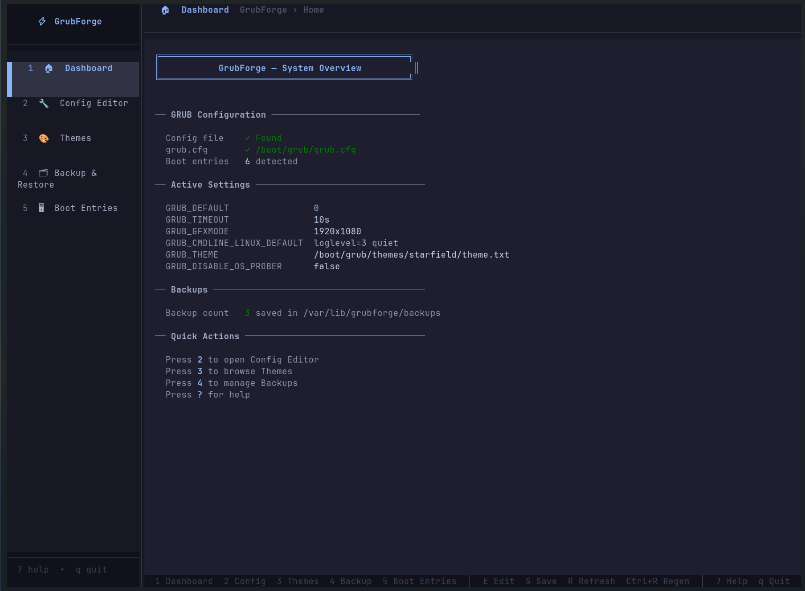
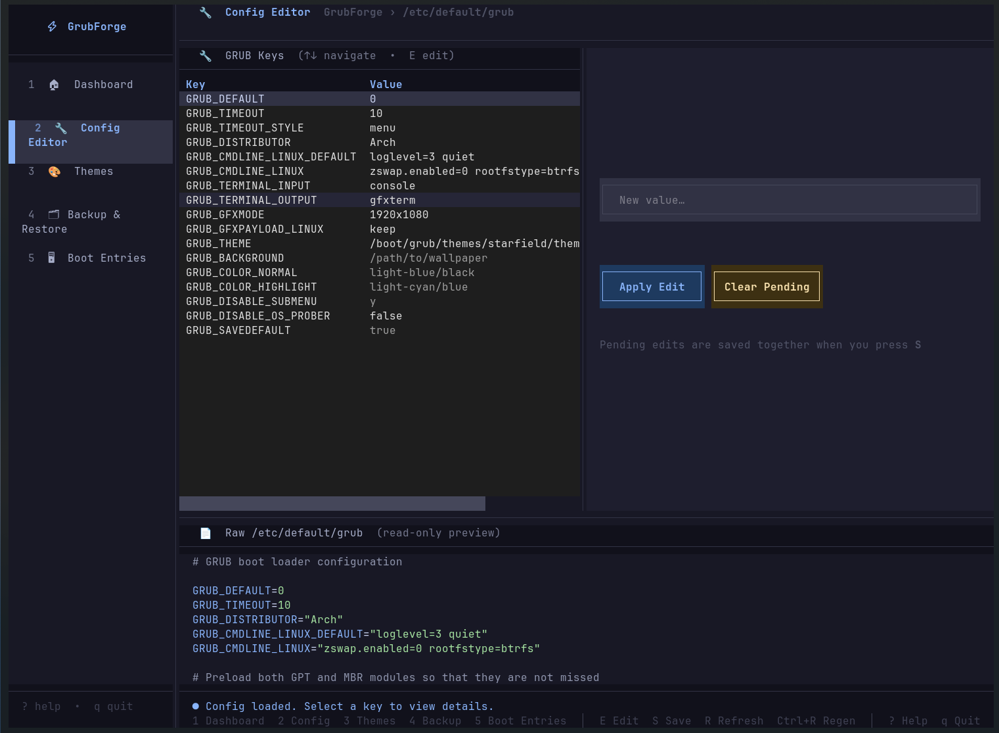
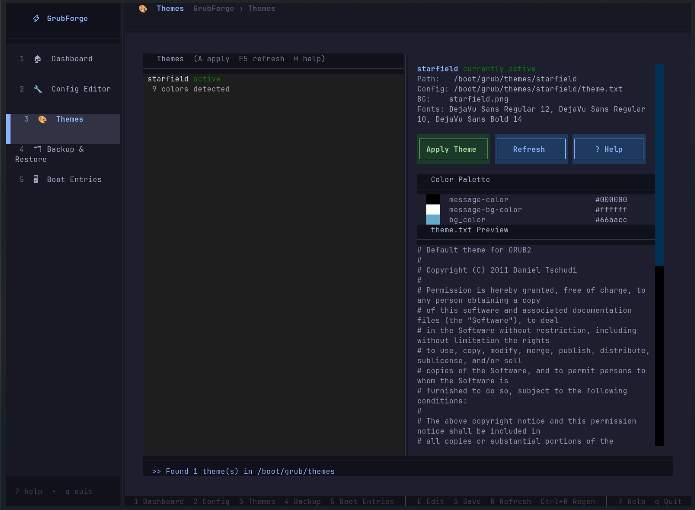
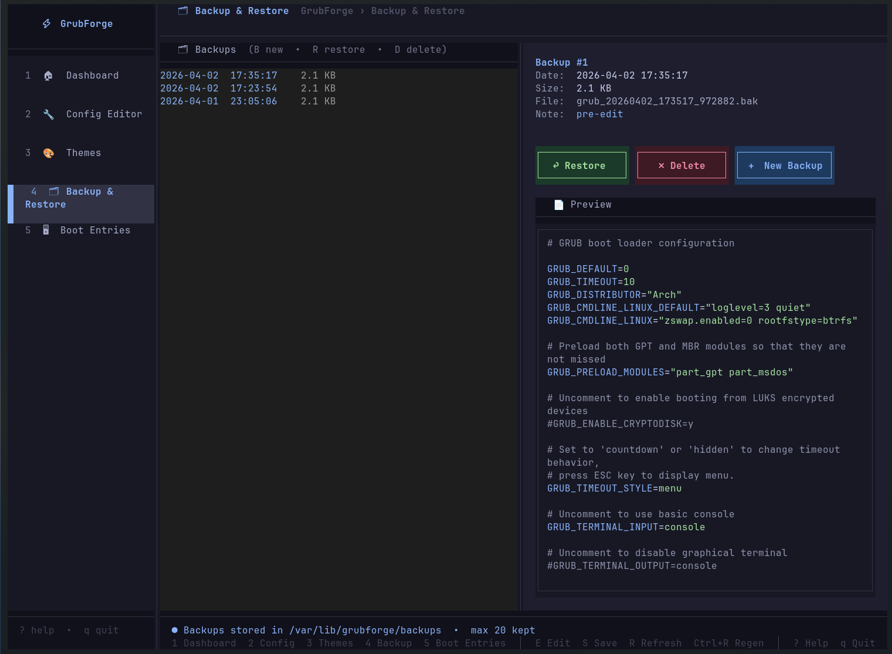
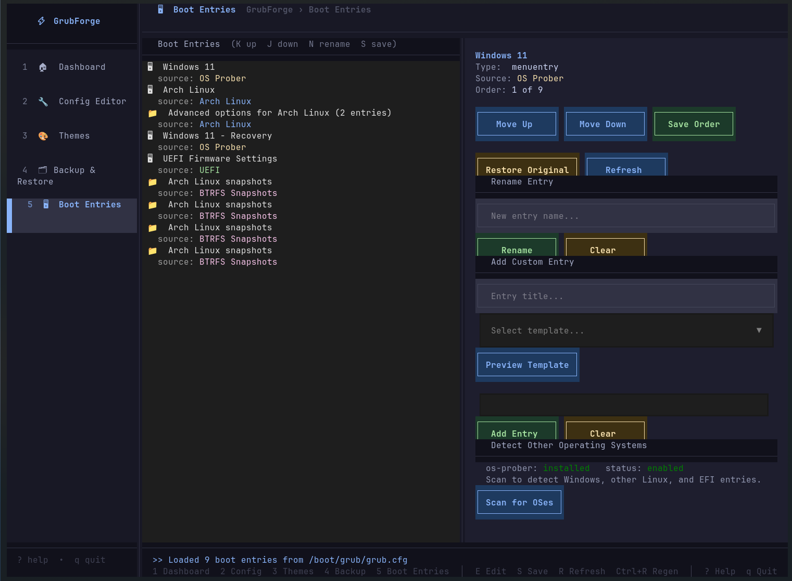

# ⚡ grubForge

> A terminal UI application for managing and customizing the GRUB bootloader on Linux — safely, intuitively, and beautifully.


[](https://aur.archlinux.org/packages/grubforge)

> 🛡 **Security:** every release is GPG-signed and every commit GitHub-Verified. Read **[Where We Stand](https://github.com/jetomev/KognogOS/blob/main/docs/where-we-stand.md)** — our response to the 2026 AUR supply-chain attacks, what is current, and how to verify us instead of trusting us.

---

## Why grubForge?

GRUB is the first program your computer runs after powering on. It is responsible for loading your operating system — and if it breaks, your machine won't boot. Editing it has traditionally meant opening a terminal, manually editing a configuration file as root, hoping you didn't make a typo, and running a command to compile the changes.

There is no safety net. One wrong character can leave you staring at a black screen.

**grubForge exists to change that.**

We believe managing your bootloader should be:
- **Safe** — automatic backups before every change, confirm dialogs before every action
- **Clear** — every setting explained in plain language, live validation before anything is written
- **Beautiful** — a Catppuccin Mocha themed TUI that feels like a proper application, not a 1980s config screen
- **Accessible** — keyboard-driven, fast, and usable by people who are not bootloader experts

grubForge was born from a simple frustration: why is one of the most critical pieces of your Linux system also one of the most unfriendly to interact with? It doesn't have to be.

---

## Features

- 🏠 **Dashboard** — system overview showing GRUB config status, active settings, backup count, and a live sync indicator that flags when `grub.cfg` is out of date with `/etc/default/grub`
- 🔧 **Config Editor** — view and edit all GRUB settings with descriptions and live validation; required vs optional keys distinguished so optional keys can be cleared
- 🎨 **Theme Browser** — browse locally installed GRUB themes, preview color palettes, apply with one key, and get guided help on installing new themes
- 🖥 **Boot Entries** — reorder, rename, and create custom boot entries, detect other OSes via os-prober, save a custom order, and restore the original at any time
- 🗂 **Backup & Restore** — timestamped backups created automatically before every change; FIFO retention caps the directory at 10 backups
- 🔄 **grub-mkconfig** — regenerate your boot menu in one keystroke after any change
- ⌨️ **Universal action bindings** — `E` Edit, `S` Save, `A` Apply, `R` Refresh, `Ctrl+R` Regen all fire from every screen and dispatch to the active screen's handler; section-local keys never collide with the universals
- 🚦 **Read-only demo mode** — launch without `sudo` for safe exploration; a red **DEMO** badge in the sidebar makes the mode obvious, and destructive actions show a graceful "Read-only mode — relaunch with sudo" message instead of an OS errno
- 🌙 **Catppuccin Mocha** — a beautiful, consistent dark theme throughout

---

## Screenshots

### Dashboard


### Config Editor


### Theme Browser


### Backup & Restore


### Boot Entries


---

## Requirements

- Linux (developed and tested on Arch Linux)
- Python 3.10 or newer
- GRUB bootloader installed
- `python-textual` and `python-rich`

---

## Installation

### Arch Linux — AUR (recommended)

grubForge is available on the Arch User Repository:
[https://aur.archlinux.org/packages/grubforge](https://aur.archlinux.org/packages/grubforge)

```bash
yay -S grubforge
```

### Arch Linux — From source

```bash
sudo pacman -S python-textual python-rich
git clone https://github.com/jetomev/grubforge.git
cd grubforge
```

### Other distributions

```bash
pip install textual rich
git clone https://github.com/jetomev/grubforge.git
cd grubforge
```

---

## Usage

### Installed via AUR

```bash
sudo grubforge
```

### Running from source

```bash
cd grubforge
sudo python main.py
```

> `sudo` is required to write to `/etc/default/grub`, manage `/etc/grub.d/` scripts, and run `grub-mkconfig`.
> You can run without `sudo` to explore the app safely in read-only demo mode.

---

## Keybindings

grubForge uses a **universal binding model**: action keys (Edit, Save, Apply, Refresh, Regen) work from every screen and dispatch to the active screen's appropriate handler. Section-specific keys (move, rename, restore, delete, new) are local to the screen they belong to and never collide with the universals. Pressing a universal key on a screen that doesn't support it shows a friendly notification rather than failing silently.

### Universal — any screen

| Key | Action |
|-----|--------|
| `1`–`5` | Switch to Dashboard / Config Editor / Theme Browser / Backup & Restore / Boot Entries |
| `E` | Edit (Config Editor) |
| `S` | Save (Config Editor — save pending changes; Boot Entries — save custom order) |
| `A` | Apply (Theme Browser — apply selected theme) |
| `R` | Refresh the current screen |
| `Ctrl+R` | Regenerate `grub.cfg` via `grub-mkconfig` |
| `?` | Help overlay (`Esc` to close) |
| `q` | Quit |

### Backup & Restore (screen 4)

| Key | Action |
|-----|--------|
| `N` | Create a new manual backup |
| `X` | Restore the selected backup |
| `D` | Delete the selected backup |
| `F5` | Refresh (alias for universal `R`) |

### Boot Entries (screen 5)

| Key | Action |
|-----|--------|
| `K` | Move selected entry up |
| `J` | Move selected entry down |
| `N` | Rename the selected entry |
| `X` | Restore the original boot order |
| `F5` | Refresh (alias for universal `R`) |

### Theme Browser (screen 3)

| Key | Action |
|-----|--------|
| `H` | Toggle the theme installation help guide |
| `F5` | Refresh (alias for universal `R`) |

---

## Project Structure

```
grubforge/
|-- main.py                      # Entry point
|-- grubforge.1                  # Man page
|-- pkg/
|   |-- PKGBUILD                 # Packaging artifact
|-- testing/
|   |-- *.md                     # Test Matrix, Test Results, Release Checklist
|-- grubforge/
    |-- app.py                   # Main Textual application shell + universal bindings dispatcher
    |-- config_manager.py        # GRUB config parser, writer, validator (required vs optional keys)
    |-- backup_manager.py        # Backup create, list, restore, delete (FIFO cap at MAX_BACKUPS=10)
    |-- theme_manager.py         # Theme scanner, parser, color extractor
    |-- boot_entries_manager.py  # Boot entry parser, reorder, grub.d manager
    |-- grubforge.css            # Catppuccin Mocha stylesheet
    |-- screens/
    |   |-- dashboard.py         # System overview screen with sync indicator
    |   |-- config_editor.py     # Config editor screen
    |   |-- themes.py            # Theme browser screen
    |   |-- boot_entries.py      # Boot entries screen
    |   |-- backup.py            # Backup & restore screen
    |-- widgets/
        |-- confirm_dialog.py    # Reusable confirmation dialog
```

---

## Safety Philosophy

grubForge is built around one principle: **never break the bootloader**.

Every change goes through three layers of protection:

1. **Validation** — your input is checked before it is staged
2. **Confirmation** — a dialog asks you to confirm before anything is written
3. **Backup** — a timestamped backup of your current config is created automatically before every write

Backups are stored in `/var/lib/grubforge/backups` and can be restored from within the app at any time.

When reordering boot entries, grubForge disables the auto-generate scripts in `/etc/grub.d/` rather than editing generated files directly. This is the same approach used by grub-customizer and is fully reversible with one button press.

> **Important caveat — kernel updates while custom order is active.** While a custom boot order is saved, the auto-generate scripts (`10_linux`, `30_os-prober`, `30_uefi-firmware`) are non-executable. Any subsequent `grub-mkconfig` run — including the ones triggered automatically by kernel-update post-install hooks — will produce a `grub.cfg` **without** auto-detected linux entries. New kernels will not appear in the boot menu until you press **Restore Original** in the Boot Entries screen, or add them manually as custom entries. If your system installs kernel updates regularly, prefer keeping grubForge in default-order mode and only saving a custom order on demand.

---

## Roadmap

- [ ] **[#19](https://github.com/jetomev/grubforge/issues/19) — frozen entries vs. Config Editor** *(field-found 2026-08-10; queued for the forgekit cycle)*: when boot entries are frozen into `40_custom`, `GRUB_CMDLINE_LINUX_DEFAULT` and `GRUB_DISTRIBUTOR` silently have no effect. Warn, and offer to apply to the frozen entries or unfreeze. Also: make save→regenerate consistent between Config Editor and Theme Browser.

- [ ] Config regeneration / stale-state behavior — document guarantees when `/etc/default/grub` changes outside the session ([#17](https://github.com/jetomev/grubforge/issues/17))
- [ ] Coherent v2 layout pass — fix small-terminal cramping across Boot Entries, Config Editor, Theme Browser
- [ ] Configurable preferences (custom backup retention, theme paths, etc.)
- [x] v1.0.3 UX hotfix batch — Dashboard refresh, feedback surface unification, Ctrl+R as true app-level binding, discrete widget bugs (15 findings closed)
- [x] Textual 8.x `events.Click` API compat (v1.0.2 — unblocks anyone on `python-textual ≥ 8.2.7`)
- [x] Backup retention cap with FIFO rotation (v1.0.1)
- [x] Dashboard `grub.cfg` sync indicator (v1.0.1)
- [x] Read-only demo-mode indicator (v1.0.1)
- [x] Universal action bindings architecture (v1.0.1)
- [x] Packaged installer (AUR)
- [x] Man page
- [x] Screenshots in README
- [x] OS detection and os-prober integration
- [x] Custom boot entry creation
- [x] Boot entry renaming
- [x] Boot entry reordering
- [x] Theme browser with help guide
- [x] grub-mkconfig integration
- [x] Automatic backup and restore
- [x] Config editor with live validation
- [x] Dashboard with system overview

---

## Changelog

### v1.0.3 — May 27, 2026
**UX hotfix batch — 15 findings from the v1.0.1-stable retest (F1–F15)**

Closes the full milestone of findings from the deep v1.0.1-stable retest (see `testing/20260526 - Test Results for grubForge v1-0-1-stable.md`). Shipped in four thematic groups:

- 🔄 **Refresh-on-show + Dashboard sync states** *(F3, F4, F5, F8, F10)* — every screen now re-reads disk state when shown, so a Config Editor save, a new backup, or a theme apply is reflected without a manual refresh. The Dashboard gains a distinct yellow "⚠ pending changes" sync state (separate from "grub.cfg older" drift and "✓ in sync"), and pressing **R** on the Dashboard now confirms with a toast instead of firing silently.
- 🧭 **Ctrl+R is a true app-level action** *(F7, F11, F12, F13)* — `grub-mkconfig` regeneration now runs from **any** screen, not just the Config Editor. The global **A** binding mirrors the Config Editor's "Apply Edit" button, and the old "go to Config Editor and press Ctrl+R" cross-screen instructions are gone.
- 💬 **Unified feedback surface** *(F9)* — a shared `StatusMixin` routes all action feedback through one consistent channel (persistent status line + toast popup), replacing five near-identical per-screen helpers and a divergent ASCII/unicode icon set.
- 🐛 **Discrete widget fixes** *(F1, F2, F6, F14, F15)* — the **DEMO** badge renders again in read-only mode; **?** opens a real toggleable help modal (Esc/q/? to close) instead of a stacking toast; the backup preview scrolls; **E** with no row selected auto-selects the first key; and **N/X/D** (Backup), **K/J/N/X** (Boot Entries) fire on screen entry without a panel click first.

No dependency or install-layout changes. Same `python`, `python-textual`, `python-rich`.

### v1.0.2 — May 26, 2026
**Hotfix — Textual 8.x API compatibility (BLOCKER)**

Fixes [GitHub Issue #1](https://github.com/jetomev/grubforge/issues/1), filed by `@jfp42` on 2026-05-19: grubforge crashed on import with `AttributeError: type object 'Static' has no attribute 'Clicked'` on Python 3.13 + Textual 8.2.7. Textual deprecated/removed `Static.Clicked` between the version grubforge was developed against and 8.2.7, so every install on a rolling distro (Arch et al.) was breaking at first launch as soon as `python-textual` got upgraded.

**The fix:**

```python
# v1.0.1 (broken on Textual ≥ 8.2.7):
def on_static_click(self, event: Static.Clicked) -> None:
    wid = getattr(event.widget, "id", "") or ""
    if wid.startswith("nav-"):
        self._switch_to(wid[4:])

# v1.0.2 (works on both old and new Textual):
def on_click(self, event: events.Click) -> None:
    wid = getattr(event.widget, "id", "") or ""
    if wid.startswith("nav-"):
        self._switch_to(wid[4:])
```

`events.Click` is the underlying event type the now-removed `Static.Clicked` was a subclass of. The handler filters by widget id (`nav-*` prefix) so non-nav clicks pass through harmlessly — identical behavior to v1.0.1.

**Other changes in this release:**

- 🛡 **PKGBUILD `check()` step added** — runs `python -c "from grubforge.app import GrubForgeApp"` during `makepkg`. Catches future Textual API breaks at build time so we never ship an unimportable package again.
- 📋 **Test Matrix section 8** — Textual API compat regression-guard entries.

**No other behavior changes.** Same dependencies (`python`, `python-textual`, `python-rich`). Same install layout. Same keybindings, screens, theme. F1–F15 findings from the v1.0.1-stable retest (see `testing/20260526 - Test Results for grubForge v1-0-1-stable.md`) are deferred to **v1.0.3** — that's the bigger UX batch covering Dashboard refresh, feedback unification, and global-binding architecture.

**Credit:** v1.0.2 exists because `@jfp42` filed a detailed traceback on a Debian Sid install. Thank you.


*The complete history lives in [docs/CHANGELOG.md](docs/CHANGELOG.md).*

## Authors

**jetomev** — idea, vision, direction, testing

**Claude (Anthropic)** — co-developer, architecture, implementation

This project was built as a collaboration between a human with a great idea and an AI that helped bring it to life — one command at a time.

---

## License

grubForge is free software: you can redistribute it and/or modify it under the terms of the **GNU General Public License v3.0** as published by the Free Software Foundation.

See [LICENSE](LICENSE) for the full license text.

---

## Contributing

Contributions are welcome! Please open an issue or pull request on GitHub.

If you find grubForge useful, consider starring the repository — it helps others find it.
