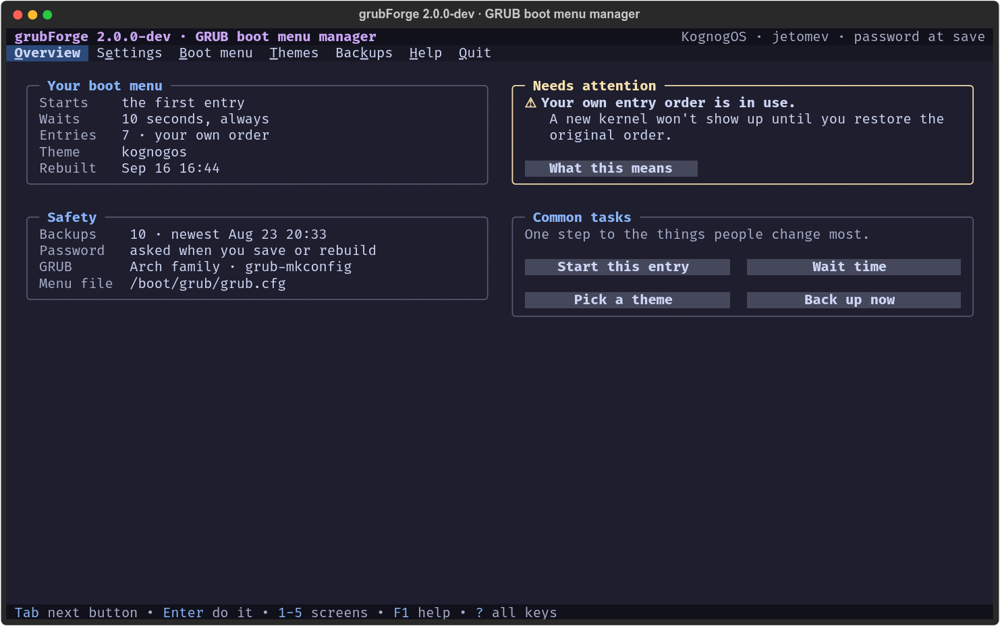
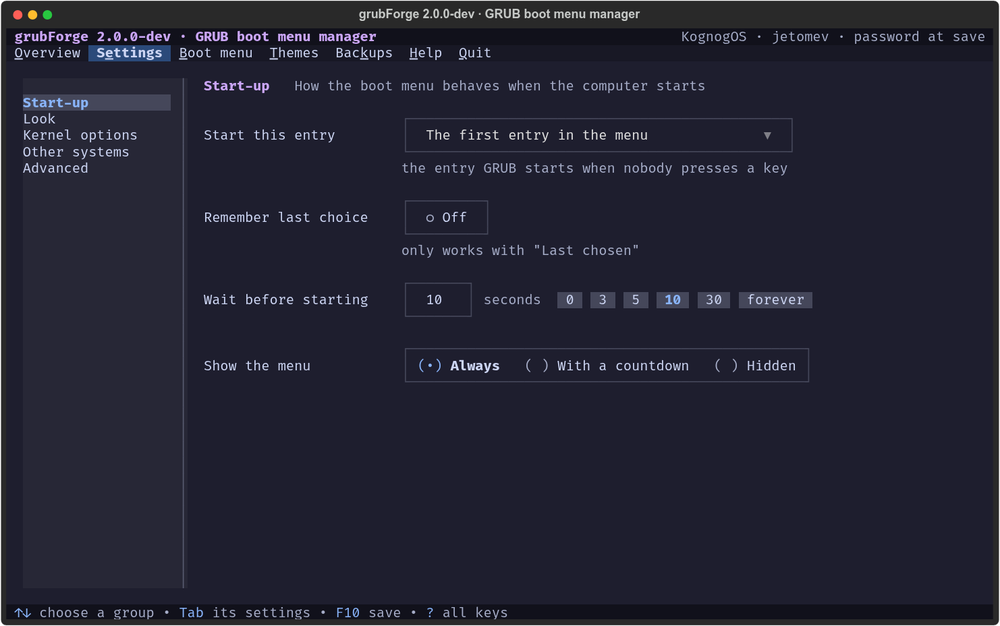
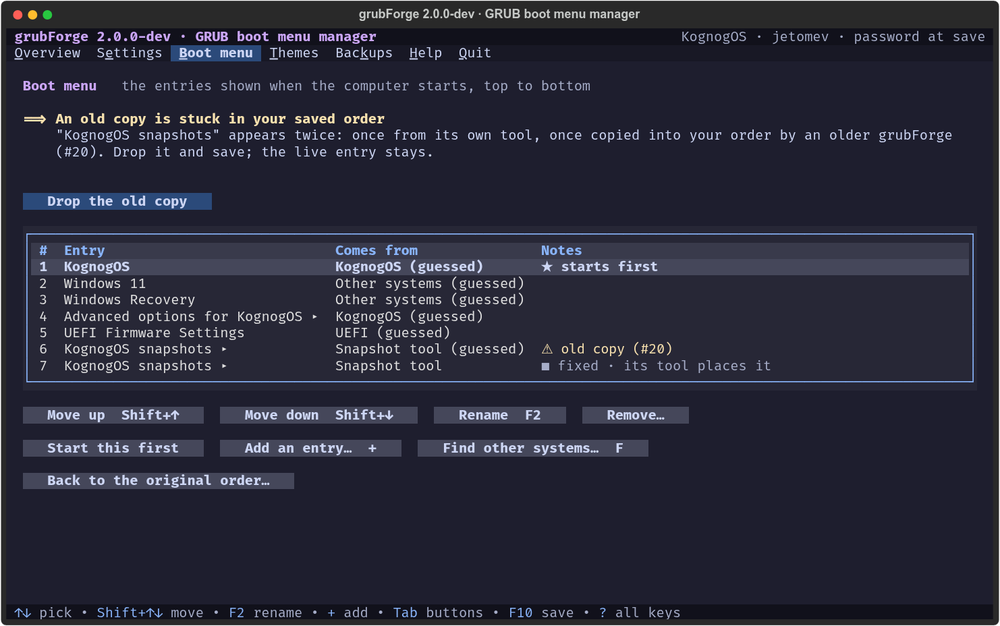
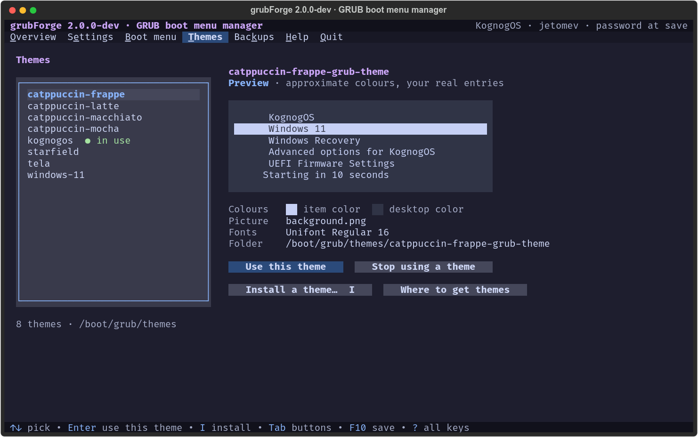
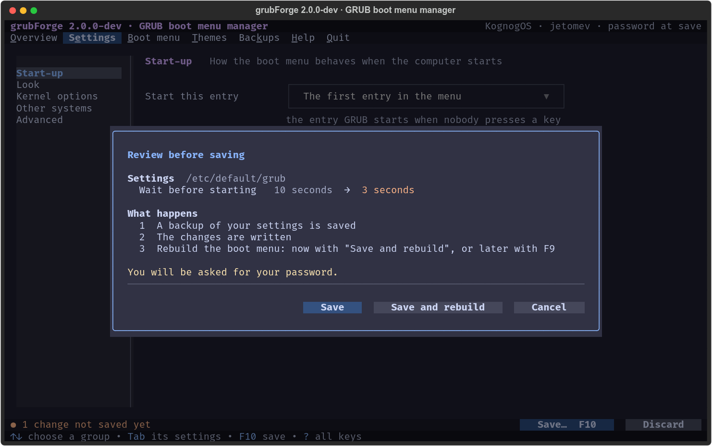

# ⚡ grubForge

> The GRUB boot menu, without editing files by hand: every setting in plain words, picked from lists, reviewed before it's written, with a backup first.


[](https://aur.archlinux.org/packages/grubforge)

> 🛡 **Security** — every release is GPG-signed and every commit is GitHub-Verified. **[Where We Stand](https://github.com/jetomev/KognogOS/blob/main/docs/where-we-stand.md)** covers our response to the 2026 AUR supply-chain attacks and how to check us yourself.

---

## Why grubForge?

GRUB is the first program your computer runs when you turn it on. Its job is to load your operating system, and if it breaks, your machine doesn't start.

Changing it has traditionally meant editing a configuration file as root, hoping you didn't make a typo, and running a command to rebuild the menu. One wrong character can leave you looking at a black screen.

**grubForge exists to change that.** It should be:

- **Safe**: a review of every change before it's written, a backup first, nothing installed or removed without asking
- **Clear**: every setting with a plain name and an explanation, and the GRUB name shown for those who want it
- **Easy**: known values are picked from lists; you type only names and unusual kernel options
- **Honest**: when something you saved isn't in the boot menu yet, or a setting is decided somewhere else, it says so

---

## Features

- 🏠 **Overview**: "is my boot menu all right?" in four boxes. Anything that needs attention comes with the button that fixes it.
- 🔧 **Settings**: every GRUB setting as a form, in five groups (Start-up, Look, Kernel options, Other systems, Advanced). Lists, worded On/Off switches, presets, a kernel-options checklist with an explanation per option, colours with a sample. "● changed" and "was: …" on each row you change.
- 🖥 **Boot Menu**: the menu as it shows at start-up. Move, rename, choose what starts first, remove, add an entry built from this computer (kernels, start-up images, disks, EFI loaders) and checked by GRUB's own checker, find other systems.
- 🎨 **Themes**: a preview of *your* entries in the theme's colours; install a downloaded theme safely.
- 🗂 **Backups**: why each was made, in plain words, and what restoring it would change, before you do.
- 💾 **Save and Rebuild, separately**: **F10** saves (review, backup, write); **F9** rebuilds the boot menu. "Saved · not in the boot menu yet" stays visible until you rebuild, and quitting asks first.
- 📖 **A manual inside the app** (**M**), and **F1** on anything opens its page.
- ⌨ **Every menu entry has a key** *(2.2)*: **1 – 6** in the order of the menu bar (Help is 6), or **Ctrl** + the underlined letter. Every button shows its own key in brackets, like **Save Changes (s)**.
- 🧩 **A page of hypeForge Settings** *(2.2)*: hypeForge's Settings window can show grubForge as one of its pages (see [Inside hypeForge Settings](#inside-hypeforge-settings)).
- 🖥 **Works on a plain text console**, where you end up when the desktop won't start: readable, and since 2.1 it can save there too.
- 🐧 **Every major distribution**: Arch, Debian/Ubuntu, Fedora/RHEL, openSUSE and more, each found automatically.
- 🔐 **Runs as you, not as root** *(2.1)*: when a change needs permission, grubForge asks for your password **in its own box** (on the desktop and on a text console alike), and polkit checks it. grubForge never runs as root; only its small helper does, for one fixed job at a time.
- 🌙 **Catppuccin Mocha**, on [forgekit](https://github.com/jetomev/forge-suite/tree/main/forgekit), the Forge Suite's shared base.

---

## Screenshots

### Overview


### Settings


### Boot Menu


### Themes


### Review before saving


---

## Requirements

- Linux with GRUB (any major distribution; see the table below)
- Python 3.10 or newer
- `python-textual`, `python-rich` and [`python-forgekit`](https://github.com/jetomev/forge-suite/tree/main/forgekit) 0.10.0 or newer (which also needs `python-pyte`)
- **`polkit`** and **`python-gobject`**: how grubForge asks for permission without running as root, with the password asked in its own box. Almost every desktop install already has both.

---

## Installation

### Arch Linux and KognogOS, from the AUR (recommended)

```bash
nog install grubforge      # KognogOS
yay -S grubforge           # any AUR helper
```

[aur.archlinux.org/packages/grubforge](https://aur.archlinux.org/packages/grubforge)

### Any other distribution

```bash
git clone https://github.com/jetomev/grubforge.git
cd grubforge
python3 -m venv .venv && .venv/bin/pip install textual rich pyte
git clone https://github.com/jetomev/forge-suite.git ../forge-suite
sudo sh install-helper.sh
PYTHONPATH=../forge-suite/forgekit .venv/bin/python main.py
```

`install-helper.sh` copies two files and nothing else: the helper to `/usr/lib/grubforge/` and the polkit rule to `/usr/share/polkit-1/actions/`, both owned by root. polkit only runs a helper installed at the exact path named in its policy. Without it grubForge still runs, read-only, and says so.

forgekit, the base grubForge is built on, lives in the [Forge Suite](https://github.com/jetomev/forge-suite) repository. A virtual environment is used because most current distributions refuse `pip install` into the system Python. If yours packages `textual`, `rich` and `pyte`, prefer those. The password box also needs your distribution's PyGObject package (`python3-gi` on Debian and Ubuntu); without it the password is asked the usual way.

### Where GRUB lives

grubForge finds these by itself and shows what it found on the Overview.

| Family | Examples | GRUB lives in | Rebuilt by | Tested in a VM |
|---|---|---|---|---|
| Arch | Arch, KognogOS, EndeavourOS, Manjaro | /boot/grub | grub-mkconfig | KognogOS |
| Debian | Debian, Ubuntu, Mint, Zorin | /boot/grub | grub-mkconfig | Debian 13, Ubuntu 24.04 |
| Fedora | Fedora, RHEL, Rocky, Alma | /boot/grub2 | grub2-mkconfig | Fedora 44 |
| openSUSE | Tumbleweed, Leap | /boot/grub2 | grub2-mkconfig | Tumbleweed |
| Others | Gentoo, Void… | /boot/grub | grub-mkconfig | — |

- **Debian and Ubuntu** also read `/etc/default/grub.d/*.cfg` after `/etc/default/grub`. A setting decided there is shown with its real value and file, locked, because changing it in the main file would have no effect.
- **Fedora-style systems** keep each Linux entry as its own file (`/boot/loader/entries`). grubForge shows them; you choose what starts first in Settings.
- **Systems that don't use GRUB** (Pop!_OS uses systemd-boot) open read-only, and grubForge says why.

---

## Usage

```bash
grubforge               # open grubForge
grubforge --version     # print the version
grubforge --help        # print the usage
```

**No `sudo`.** Run it as yourself. When a change needs permission, grubForge asks for your password in its own box, on the desktop and on a text console alike (since 2.1).

> **Why grubForge never runs as root.** Permission goes through **polkit**, the permission system your desktop already uses: polkit's own helper checks the password, and only grubForge's small, fixed helper runs as root. That helper accepts a short list of specific jobs. It can't be handed a command to run.

Over SSH, grubForge's polkit rule refuses permission, so run `sudo grubforge` there.

When grubForge closes, the terminal gets a short record: what you saved, whether the boot menu has it, the backup, where the run was logged (`~/.local/share/grubforge/logs/`), and a thank-you.

### Inside hypeForge Settings

hypeForge's Settings window can show grubForge as one of its pages. It starts grubForge as `grubforge --hypeforge` (any capitals work, `--hypeForge` too). Started that way, grubForge has **no Quit of its own**: Quit isn't in the menu bar, and Q and Ctrl+Q do nothing. Settings closes grubForge instead, and grubForge first asks the same question its own Quit asks when something isn't saved, or is saved but not in the boot menu yet. Your answer decides whether it closes. The option is for Settings, so `grubforge --help` doesn't list it.

---

## Keys

| Key | Does |
|---|---|
| Tab / Shift+Tab | next / previous field or button |
| Enter | open a list, press a button, confirm |
| Space | flip a switch, tick a box |
| Esc | close a window |
| 1 – 6, or Ctrl + the underlined letter | Overview, Settings, Boot Menu, Themes, Backups, Help |
| F10, or S | save, with a review first |
| F9, or Ctrl+R | rebuild the boot menu |
| R | read the files again |
| F1 | help on what is selected |
| M | the manual |
| ? | all keys |
| Q, or Ctrl+Q | quit (asks first if something isn't finished); not there inside hypeForge Settings |

In lists: **Shift+↑↓** moves an entry, **F2** renames, **+** adds, **F** finds other systems (Boot Menu); **I** installs a theme (Themes); **N / R / D** back up, restore, delete (Backups). Letter keys never act while you're typing in a field. A button shows its key in brackets after its name: **Save Changes (s)**, **Rebuild Boot Menu (F9)**, **Rename (F2)**.

The full manual is in [`grubforge/manual/`](grubforge/manual/), and inside the app with **M**.

---

## Safety

grubForge is built around one rule: **never break the bootloader.**

1. **Review**: before anything is written you see every change as old → new.
2. **Backup**: your settings, and your boot-order file, are saved first. The last 10 are kept in `/var/lib/grubforge/backups`.
3. **Permission**: polkit authorises the change. grubForge asks for the password in its own box (2.1) and polkit's own helper checks it; grubForge never sees whether it was right, and never runs as root.
4. **Rebuild when you choose**: what you save stays saved; the boot menu changes when you rebuild.

### The helper's fixed list of jobs

| Job | What it does |
|---|---|
| `write-config` | Save `/etc/default/grub` (only `KEY=value` lines) |
| `write-custom-40` | Save your boot order |
| `regenerate` | Rebuild the boot menu (grub-mkconfig or grub2-mkconfig, chosen by the helper itself) |
| `backup-create` / `-restore` / `-delete` | Manage backups (only grubForge's own backup names) |
| `script-enable` / `script-disable` | Turn the four GRUB scripts grubForge manages on and off |
| `os-prober-run` | Look for other operating systems |
| `read-entries` | Read the boot menu when grub.cfg is root-only (menu entries only, never a password hash) |
| `theme-install` | Install a theme: plain files and folders only, nothing reaching outside the theme's folder, size limits, `theme.txt` required, never overwrites |

**You can't hand the helper a command to run.** If you could, it would be a way to run anything as root, which is exactly what it exists to prevent.

### Your own boot order, and new kernels

Saving your own order writes the entries to `/etc/grub.d/40_custom` and turns off the scripts that made them, so your order stays. **Those scripts then no longer add new kernels by themselves.** After a kernel update, go **Back to the Original Order**, rebuild, and arrange again if you want. grubForge says this on the Overview, the Boot Menu screen and in Kernel options while your order is in use.

Entries made by other tools (btrfs snapshots, Debian's memtest) are **fixed**: their tool keeps placing them, and grubForge never copies them into your order, so they can't appear twice.

---

## How this project is built

grubForge is a human and AI collaboration, and we've written down how that works in practice.

📖 **[Building grubForge with AI](docs/AI-COLLABORATION.md)**, and the screen design that 2.0 was built from: [`docs/design/v2.0.0-screens.html`](docs/design/v2.0.0-screens.html). The `testing/` folder holds every test matrix, published on purpose.

---

## Roadmap

### Next

- [ ] **Write settings into `/etc/default/grub.d`** on Debian and Ubuntu, so settings decided there can be changed from grubForge too (today they're shown, locked, with the file to edit) ([#34](https://github.com/jetomev/grubforge/issues/34))
- [ ] **Fedora-style entries**: rename and reorder entries kept as separate files ([#35](https://github.com/jetomev/grubforge/issues/35))
- [ ] **Configurable preferences**: backup retention, theme folder

### Done

- [x] **v2.2.0**: a key for every menu entry (Help is 6), "Boot Menu", a page of hypeForge Settings, buttons that show their key ([#38](https://github.com/jetomev/grubforge/issues/38), [#39](https://github.com/jetomev/grubforge/issues/39), [#40](https://github.com/jetomev/grubforge/issues/40))
- [x] **v2.1.0**: the password in grubForge's own box, and saving on a text console ([#36](https://github.com/jetomev/grubforge/issues/36))
- [x] Earlier releases: [docs/ROADMAP.md](docs/ROADMAP.md)

---

## Changelog

### v2.2.0 — October 8, 2026

**A key for every menu entry, "Boot Menu", a page of hypeForge Settings, and buttons that show their key.** Javier found the first three on October 8 while running grubForge inside hypeForge Settings.

- ⌨ **Help has a number now** ([#38](https://github.com/jetomev/grubforge/issues/38), F-6). The numbers **1 – 6** follow the menu bar, Help included (Quit has none), and **Ctrl** + an entry's underlined letter goes there too. The bottom bar says **1-6 menu** instead of the confusing "1-5 screens". These keys now come from [forgekit](https://github.com/jetomev/forge-suite/tree/main/forgekit) 0.10.0, which makes them from the menu itself, so no entry can be left without a key again.
- 🔤 **"Boot Menu"** ([#39](https://github.com/jetomev/grubforge/issues/39), F-7): the screen's name in the menu bar, on the screen itself, in the manual and here.
- 🧩 **A page of hypeForge Settings** ([#40](https://github.com/jetomev/grubforge/issues/40)): started as `grubforge --hypeforge` (any capitals), grubForge has no Quit of its own. Settings closes it, and grubForge first asks its usual question when something isn't saved or isn't in the boot menu yet. `--help` doesn't list it: it's for Settings, not for people.
- 🏷 **Buttons in Javier's format** ([#40](https://github.com/jetomev/grubforge/issues/40)): the name in Title Case, then the key in brackets: **Save Changes (s)**, **Rebuild Boot Menu (F9)**, **Restore (r)**, **Find Other Systems (f)**. A button without a key of its own shows just its name. Three buttons said "(asks for your password)"; that moved into the text beside them, so brackets always mean a key.
- Also: the install steps for other distributions now fetch forgekit from the [Forge Suite](https://github.com/jetomev/forge-suite) (its old repository is archived) together with `pyte`, and the Usage section describes 2.1's password box instead of the desktop's password window.

Tests: 78 → **100** (22 new; each one was seen to fail with its fix taken out). Warnings: 3 → 3 (no change), all deprecation notices from the PyGObject library and forgekit's use of it, none from grubForge's own code. New requirement: `python-forgekit` ≥ 0.10.0.

### v2.1.0 — October 4, 2026

**The password in grubForge's own box, and saving on a text console** ([#36](https://github.com/jetomev/grubforge/issues/36)). Javier: a desktop password window *"doesn't make sense"* for a terminal app, and *"how does it work on the tty version?"* Until now it didn't: with no desktop to draw the password window, `pkexec` gave up and grubForge said to start it with `sudo`.

- 🔐 grubForge becomes polkit's password asker **for its own process only** ([forgekit 0.6.0](https://github.com/jetomev/forgekit/releases/tag/v0.6.0)'s `InAppPolkitAgent`). polkit's own helper checks the password; grubForge still never runs as root, and its helper still does one fixed job at a time. A wrong password is asked again (three tries); Cancel cancels.
- 🖥 **A text console can save now.** The manual's console pages no longer say `sudo grubforge`.
- Over SSH nothing changes: grubForge's rule still refuses permission there.

Tested in the KognogOS VM on a real text console (a wrong password asked again, the right one made a backup as root), then by Javier on his desktop (a theme change and a backup, both asked in grubForge's box: *"perfect!"*) and on tty3 (*"works wonders"*). Tests: 53. New dependency: `python-gobject`; `python-forgekit` ≥ 0.6.0.

*The complete history lives in [docs/CHANGELOG.md](docs/CHANGELOG.md).*

---

## Related Projects

- **[KognogOS](https://github.com/jetomev/KognogOS)**: the distribution grubForge ships with
- **[nog](https://github.com/jetomev/nog)**: tier-aware package manager
- **[forgekit](https://github.com/jetomev/forge-suite/tree/main/forgekit)**: the shared base for the Forge apps, in the [Forge Suite](https://github.com/jetomev/forge-suite)
- **[alacrittyForge](https://github.com/jetomev/alacrittyforge)**: terminal configurator
- **[bitlaForge](https://github.com/jetomev/bitlaforge)**: solo Bitcoin mining, honestly framed

---

## Authors

**jetomev**: idea, vision, direction, testing

**Claude (Anthropic)**: co-developer, architecture, implementation

Built as a collaboration between a human with a good idea and an AI that helped bring it to life. If you're curious how that works day to day: [Building grubForge with AI](docs/AI-COLLABORATION.md).

---

## License

grubForge is free software, released under the **GNU General Public License v3.0**. See [LICENSE](LICENSE).

---

## Contributing

Contributions are welcome: open an issue or a pull request.

Bug reports are genuinely valued here. Several releases exist because somebody outside the project took the time to write one.

If you find grubForge useful, a star helps others find it.
